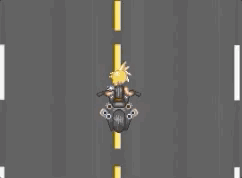
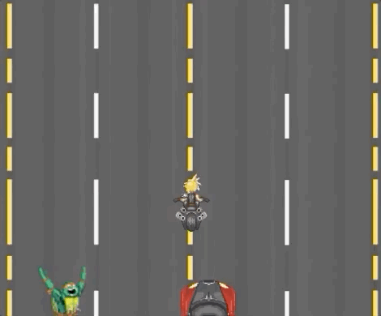
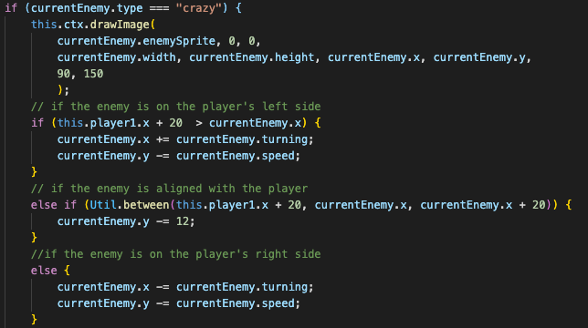
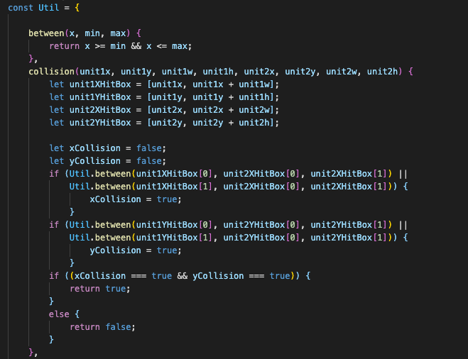

# JavaScript Project Proposal: City Escape
City escape is essentially a top-down endless runner game.  The player will control a unit that will be riding along a highway.  Enemies will randomly spawn from the front or the rear.  The player must do their best to avoid or destroy enemies with a close range attack.  Obstacles will also appear in the players path.  There will be multiple enemies each with their own unique behavior.

This project utilizes:
-   Vanilla JavaScript
    - Uses pure JavaScript with no additional libraries.
-   Canvas
    - Features mulitple canvases:
        -   Background animation loop
        -   On-screen UI elements
        -   Player's and enemy units
-   CSS
    - Simple CSS elements to display instructions as well as a music checkbox to toggle on/off the music and sound effects.

# Functionality & MVP
Players will be able to:
-   Move a unit around on-screen
-   Initiate an attack on multiple directions (left/right)
    
    

This project will include:
-   Enemy AI
    -   Enemy units will move in a certain pattern depending on the position of the player's unit.
-   Collision
    -   When the player's unit collides with another object, there will be a collision.
-   Game Over logic
    -   The player will lose health when colliding with another object.  When the player's health reaches 0, they will get a game over.

## Enemy AI
-   Certain enemy units will move according to the position of the player:
    
    
-   The below code compares the player's position with the enemy's position and adjust's it for the next frame:

    

## Collisions & Game Over Logic
-   When units collide on the canvas, there will be a collision, which will result in the player's health reducing.
-   If the player's health reaches 0, they will get a Game Over.

-   I decided to write my own custom function to detect collisions.  In order to detect when two units are colliding, I gave each unit their own hitbox parameters( 1 for the X axis and 1 for Y axis), which includes the 2 positions; their position on the canvas, and that same position + their width/height.  Then by checking if the any two units hitboxes are within range with one another, it will tell us if there is a collision.
